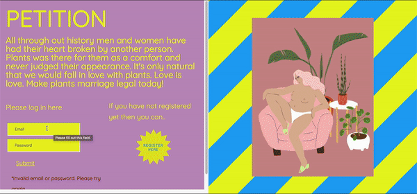

# about

All through out history men and women have had their heart broken by another person. Plants was there for them as a comfort and never judged their appearance. It's only natural that we would fall in love with plants. Love is love. Sign the petition and make plants marriage legal today!

# features

## home, register or login

Users are welcomed with a landing page and invited to register or login. They can also add bio and change their profile pics



# technologies

-   jquery
-   Handlebars
-   Node.js
-   Express.js
-   PostgreSQL

# instructions

1.  clone repository

```bash
git clone https://github.com/gugiguger/plantmarriagepetition
cd plantmarriagepetition
```

2.  install dependencies

```bash
npm install
```

3.  setup database

you need PostgreSQL at least version 9 and your system user needs to be able to access the server without a password.

```bash
createdb petition
cd sql
psql -d classof85 -f users.sql
psql -d classof85 -f user_id.sql
psql -d classof85 -f signatures.sql
```

4.  start the application

```bash
npm start
```

now go to http://localhost:8080 in your browser
